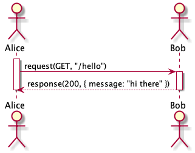
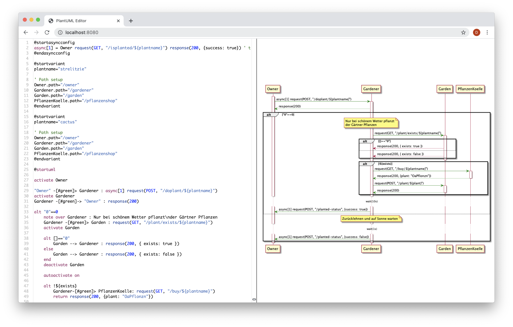

# Purpose
Plantestic is a test case generation tool which transforms sequence diagrams
written in PlantUML into REST java testcases. Each test case verifies one procedure 
of interactions by sequentially invoking the requests and asserting for the 
responses specified in the sequence diagram.

# Minimal Example
Suppose a minimal sequence diagram with two actors Alice and Bob. Alice sends an
HTTP GET request to Bob, with the subroute "/hello" and receives an HTTP response
with status code 200 and a message that reads "hi there":

```
@startuml

actor Alice as A
actor Bob as B

A -> B : request(GET, "/hello")
return response(200, { message: "hi there" })

@enduml
```



Plantestic will in this case generate the following java code:

```java
@Test
public void test() throws ScriptException, InterruptedException {
    String tester = paramsMap.get("tester");

    if (tester == null || tester.equals("A")) {
        Response roundtrip1 = RestAssured.given()
            .auth().basic(subst("${B.username}"), subst("${B.password}"))
	    .filter(paramsMap.containsKey("B.swagger") ? new OpenApiValidationFilter(subst("${B.swagger}")) : (rS, rpS, context) -> context.next(rS, rpS))
	    .when()
	    	.get(subst("${B.path}") + subst("/hello"))
	    .then()
	    .assertThat()
	    	.statusCode(IsIn.isIn(Arrays.asList(200)))
		.body("message", equalTo("hi there"))
	    .and().extract().response();
        paramsMap.put("message", roundtrip1.jsonPath().getString("message"));
    }
}
```

## Features
<!--TODO: UPDATE THIS SECTION -> NEW FEATURES & REPHRASE/UPDATE OLD ONES-->

**Plantestic is universal in that it can run in any IDE.**

For this, Plantestic uses Gradle. Original Eclipse dependencies are used! 

**Plantestic is user-friendly.**

You set it up by installing Java and downloading Plantestic.
You generate a test case by filing a sequence diagram and entering one instruction. 

**Plantestic has a powerful condition evaluation.**

A sequence diagram can contain alternative or optional interactions that it invokes under a certain condition. 
Plantestic will evaluate any condition that conforms to JavaScript. 
For this, it uses a JavaScript engine.  

**You can pass parameters to your sequence diagram if you wish to customize its flows.**

For example, you no longer need to reveal security-critical information such as passwords in your sequence diagram. 
Plantestic evaluates the parameters using templating.

## Installation
1. Install Java SE Development Kit 8. 
You can find Java SE Development Kit 8 under the website [https://www.oracle.com/technetwork/java/javase/downloads/jdk8-downloads-2133151.html](https://www.oracle.com/technetwork/java/javase/downloads/jdk8-downloads-2133151.html).
2. Clone the Plantestic repository.
3. Run `./gradlew publish`. This can take a while because the Eclipse repository is cloned.

## How to use

## Usage as Gradle plugin

A Gradle plugin is available in `./gradle-plantestic-plugin`. This plugin is not 
published to a remote repository currently. Therefore you need to install it and 
its dependencies to your local Maven repository. You can to this by executing:

```console
$ ./gradlew publish
```

After that you can copy the `./example` standalone Gradle project. Firstly 
include the plugin via:

```groovy
plugins {
    id 'de.unia.se.gradle-plantestic-plugin' version "0.1"
}
```

Now you can configure it and enable it:

```groovy
plantestic {
    sourceSet sourceSets.test.resources // Location of the puml files
}
```

You can specify where you put your `.puml` files via the `sourceSet` option.
To run the tests you simply do `./gradlew test` in the root of your project. 
The first execution can take some time because the P2 Eclipse repository is 
cloned by the plugin. Consecutive executions take significantly less time.

## Integrated PlantUML IDE
Launch the Web-IDE on localhost:8080 using `./gradlew jettyRun`. It will
automatically render live PlantUML previews for your code as well as highlight 
syntax and show inline errors for our customized PlantUML Grammar.



### Test Specification

#### Sequence Diagram Format
Refer to the [official PlantUML language guide](https://plantuml.com/sequence-diagram) to learn how to write PlantUML
sequence diagrams. Note that our Grammar does not support multiline syntax for some commands, e.g. note. To write
multiline notes, use a literal '\n': `note over Bob : This is a\nmultiline note`.
Plantestic adds some features to the PlantUML Grammar, all of which are described in the following.

#### Request Specification
Plantestic recognizes request specifications in PlantUML Message descriptions. Generally, a request 
is expressed as a function call with a request Method, request Route and the optional parameter spec.

```
A -> B : request(<GET|POST|PUT|DELETE|PATCH>, <route>, <optional parameter spec>)
```

The following examples all constitute valid requests:

```
Alice ->  Bob : request(GET, "/weather")

Alice --> Bob : request(GET, "/weather")

Alice -> Bob : request(POST, "/message", { content: "hello Bob :)", type: "text/plain" })
```

In all three examples, Alice sends a request to Bob as signified by the arrow direction.

#### Response Specification
Plantestic recognizes response specifications in PlantUML Message descriptions and Return statements.
Generally, a response is expressed as a function call with one or more acceptable status codes and 
optional descriptions and an optional parameter spec.

```
B -> A : response(<((INT DESCRIPTION?) (|| INT DESCRIPTION?)*)>, <optional parameter spec>)

return response(<((INT DESCRIPTION?) (|| INT DESCRIPTION?)*)>, <optional parameter spec>)
```

The following examples all constitute valid responses:

```
Bob -> Alice : response(200, { weather: "sunny" })

return response(200, { weather: "sunny")

Bob -> Alice : response(410 || 418 I_AM_A_TEAPOT)

return response(410 || 418 I_AM_A_TEAPOT)
```

In all four examples, Bob returns a response to Alice. Note that return statements match
the first preceeding request - if available. Parameter specifications are optional as with requests.
Responses may specify multiple acceptable response codes and an optional description for each code,
to make their semantic intent explicit.

#### Async Requests
<!--TODO: ADD ASYNC REQUESTS-->

<!--TODO: UPDATE THE FOLLOWING SECTIONS-->
#### Variants

Variants can be prepended to PlantUML files:


For each variant a separate test case is generated.

#### Environment variables

All environment variables are accessible in the sequence diagrams via string substitution.
This means you can add the text `${SECRET_PASSWORD}` in the sequence diagram and export 
the variable before running the tests via the Gradle plugin:

```
export SECRET_PASSWORD=1234656
./gradlew test
``` 

### Standalone Execution
1. Create a PlantUML sequence diagram. Note the input requirements above. 
2. Save the sequence diagram. 
3. Call the command `./gradlew run --args="--input=<path/to/sequence/diagram/diagram_name.puml> --output <output_dir>"`.

The generated test cases are in `<output_dir/<diagramName>.java>`.

## PlantUML Grammar

We created a new Grammar for PlantUML from scratch. The subproject is split into three parts:

* xyz.elite.xtext.languages.plantuml - Grammar and generators
* xyz.elite.xtext.languages.plantuml.ide - Currently unused IDE
* xyz.elite.xtext.languages.plantuml - Web IDE with live preview

The grammer supports all of the official PlantUml syntax except for the special
multiline syntax, e.g., for notes. To achieve multiline notes, simply use the
literal '\n' in the description of your notes:

```
note over Bob : this is a\nmultiline note
```

## Limitations
- Plantestic currently only supports authenticated requests with 
  username and password.

## Credits
### Contributors

2019:
- [Stefan Grafberger](https://github.com/stefan-grafberger) *
- [Fiona Guerin](https://github.com/FionaGuerin) *
- [Michelle Martin](https://github.com/MichelleMar) *
- [Daniela Neupert](https://github.com/danielaneupert) *
- [Andreas Zimmerer](https://github.com/Jibbow) *

\* contributed equally

2020
- Dominik
- Max
- Elias
- Alex

\* contributed equally
