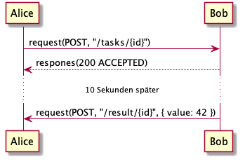

# Table of Contents
* [Purpose](#purpose)
* [Motivation](#motivation)
* [Minimal Example](#minimal-example)
* [Features](#features)
* [Installation](#installation)
* [How to use](#how-to-use)
	* [Usage as Gradle plugin](#usage-as-gradle-plugin)
	* [Standalone Execution](#standalone-execution)
	* [Integrated PlantUML IDE](#integrated-plantuml-ide)
* [Test Specification](#test-specification)
	* [Sequence Diagram Format](#sequence-diagram-format)
	* [Request Specification](#request-specification)
	* [Response Specification](#response-specification)
	* [Async Requests](#async-requests)
	* [Waiting](#waiting)
	* [Conditionals](#conditionals)
	* [Templating](#templating)
	* [Variants](#variants)
	* [Environment variables](#environment-variables)
	* [Tester](#tester)
	* [PlantUML Grammar](#plantuml-grammar)
* [Limitations](#limitations)
* [Contributors](#contributors)

# Purpose
Plantestic 2.0 the continuation of the [plantestic project](https://github.com/FionaGuerin/plantestic). It is a test case generation tool which transforms sequence diagrams written in PlantUML into REST java testcases. Each test case verifies one procedure 
of interactions by sequentially invoking the requests and asserting for the 
responses specified in the sequence diagram.

# Motivation

The implementation of user requirements often deviates from the specification of the same user requirements. Individual work, teamwork, and collaboration between teams can produce such a divergence. For example, requirements may be misinterpreted or overlooked. Teamwork, especially with multiple teams, causes interface errors. For example, subsystems of the same product may use conflicting technologies or conflicting data formats.

Our test case generator detects deviations at an early stage: The test case generator derives test cases directly from the specification. If the implementation fulfills these test cases, then the implementation fulfills the specification. If the implementation does not fulfill these test cases, the implementation deviates from the specification. With our test case generator, developers can quickly uncover inconsistencies, fix them, and save costs

# Minimal Example
Suppose a minimal sequence diagram with two actors Alice and Bob. Alice sends an
HTTP GET request to Bob, with the subroute "/hello" and receives an HTTP response
with status code 200 and a message that reads "hi there":


The following shows the plantUML specification, from which the model was derived.


Plantestic 2.0 will in this case generate the following java code:

```java
@Test
public void test() throws ScriptException, InterruptedException {
    String tester = paramsMap.get("tester");

    if (tester == null || tester.equals("A")) {
        Response roundtrip1 = RestAssured.given()
            .auth().basic(subst("${B.username}"), subst("${B.password}"))
	    .filter(paramsMap.containsKey("B.swagger") ? new OpenApiValidationFilter(subst("${B.swagger}")) : (rS, rpS, context) -> context.next(rS, rpS))
	    .when()
	    	.get(subst("${B.path}") + subst("/hello"))
	    .then()
	    .assertThat()
	    	.statusCode(IsIn.isIn(Arrays.asList(200)))
		.body("message", equalTo("hi there"))
	    .and().extract().response();
        paramsMap.put("message", roundtrip1.jsonPath().getString("message"));
    }
}
```

# Features

**Plantestic 2.0 is universal in that it can run in any IDE.**

To achieve this, Plantestic 2.0 relies on gradle. Even original eclipse dependencies
no longer have to be manually downloaded using eclipse but instead are automatically 
fetched by gradle.

**Plantestic 2.0 is user-friendly.**

1. Download java and Plantestic 2.0
2. Generate test cases by executing a single cli instruction

**Plantestic 2.0 comes with a custom Web IDE.**

Plantestic 2.0 includes a Web IDE with which you can easily create and edit your PlantUML diagrams
[how to use](###Integrated-PlantUML-IDE). It features live visual PUML rendering, syntax highlighting
and error messages.

**Plantestic 2.0 features useful error messages.**

Gone are the days of endless pondering why testcase won't generate properly since Plantestic 2.0 will
give you helpful, inline error messages both in the Web IDE and via its CLI.

**Plantestic 2.0 is actor oriented.**

Each testcase retains all information about the actors involved in requests, allowing you to 
either test the entire sequence or just requests stemming from a certain actor.

**Plantestic 2.0 supports specifying variables both at compile and at runtime.**

Use testcase variants to set variables at testcase generation time or use environment 
variables to set them dynamically at runtime. The latter feature is especially important 
to, f.e., input secrets like usernames or passwords. Compared to plantestic 1.0, you are 
therefore no longer forced to store secrets in plaintext files. Plantestic 2.0 uses 
templating to inject variables into the testcase execution flow.

**Plantestic 2.0 has a powerful condition evaluation.**

A sequence diagram can contain alternative or optional interactions that are invoked under certain conditions.
Plantestic 2.0 permits specifying these conditions using JavaScript and will evaluate them dynamically at runtime.

**Plantestic 2.0 supports more PUML than ever before.**

Plantestic 2.0 comes with builtin support for arbitrarily nested groups, return statements and delays.

**Plantestic 2.0 automatically validates your sequence diagrams against swagger API definitions.**

Plantestic 2.0 checks request and response parameters and variables against swagger API definitions.

**Plantestic 2.0 has a brand new pipeline at its core.**

Apart from gluecode, almost all functionality was either severly refactored or rewritten from the ground up:

* all new PlantUML grammar that was written from the ground up to be stable and feature rich, resulting
  in way more flexibility and robustness than Plantestic 1.0
* all new QVT transformations that are significantly more robust than Plantestic 1.0
* all new Metamodel-Magic
* all new Acceleo code generation

**Plantestic 2.0 supports adding delay to testcases.**

Use the standard PlantUML delay syntax `... wait(time) ...`  to generate Thread.sleep() statements in your tests.

# Installation

1. Install Java SE Development Kit 8. 
You can find Java SE Development Kit 8 under the website [https://www.oracle.com/technetwork/java/javase/downloads/jdk8-downloads-2133151.html](https://www.oracle.com/technetwork/java/javase/downloads/jdk8-downloads-2133151.html).
2. Clone the Plantestic 2.0 repository.
3. Run `./gradlew publish`. This can take a while because the Eclipse repository is cloned.

# How to use

## Usage as Gradle plugin

A Gradle plugin is available in `./gradle-plantestic-plugin`. This plugin is not 
published to a remote repository currently. Therefore you need to install it and 
its dependencies to your local Maven repository. You can to this by executing:

```console
$ ./gradlew publish
```

After that you can copy the `./example` standalone Gradle project. Firstly 
include the plugin via:

```groovy
plugins {
    id 'de.unia.se.gradle-plantestic-plugin' version "0.1"
}
```

Now you can configure it and enable it:

```groovy
plantestic {
    sourceSet sourceSets.test.resources // Location of the puml files
}
```

You can specify where you put your `.puml` files via the `sourceSet` option.
To run the tests you simply do `./gradlew test` in the root of your project. 
The first execution can take some time because the P2 Eclipse repository is 
cloned by the plugin. Consecutive executions take significantly less time.

## Standalone Execution

1. Create a PlantUML sequence diagram. Note the input requirements above. 
2. Save the sequence diagram. 
3. Call the command `./gradlew run --args="--input=<path/to/sequence/diagram/diagram_name.puml> --output <output_dir>"`.

The generated test cases are in `<output_dir/<diagramName>.java>`.

## Integrated PlantUML IDE
Launch the Web-IDE on localhost:8080 using `./gradlew jettyRun`. It will
automatically render live PlantUML previews for your code as well as highlight 
syntax and show inline errors for our customized PlantUML Grammar.


# Test Specification 

## Sequence Diagram Format
Refer to the [official PlantUML language guide](https://plantuml.com/sequence-diagram) to learn how to write PlantUML
sequence diagrams. Note that our Grammar does not support multiline syntax for some commands, e.g. note. To write
multiline notes, use a literal '\n': `note over Bob : This is a\nmultiline note`.
Plantestic 2.0 adds some features to the PlantUML Grammar, all of which are described in the following.

## Request Specification
Plantestic 2.0 recognizes request specifications in PlantUML Message descriptions. Generally, a request 
is expressed as a function call with a request Method, request Route and the optional parameter spec.

```puml
A -> B : request(<GET|POST|PUT|DELETE|PATCH>, <route>, <optional parameter spec>)
```

The following examples all constitute valid requests:

```puml
Alice ->  Bob : request(GET, "/weather")

Alice --> Bob : request(GET, "/weather")

Alice -> Bob : request(POST, "/message", { content: "hello Bob :)", type: "text/plain" })
```

In all three examples, Alice sends a request to Bob as signified by the arrow direction.

## Response Specification
Plantestic 2.0 recognizes response specifications in PlantUML Message descriptions and Return statements.
Generally, a response is expressed as a function call with one or more acceptable status codes and 
optional descriptions and an optional parameter spec.

```puml
B -> A : response(<((INT DESCRIPTION?) (|| INT DESCRIPTION?)*)>, <optional parameter spec>)

return response(<((INT DESCRIPTION?) (|| INT DESCRIPTION?)*)>, <optional parameter spec>)
```

The following examples all constitute valid responses:

```puml
Bob -> Alice : response(200, { weather: "sunny" })

return response(200, { weather: "sunny")

Bob -> Alice : response(410 || 418 I_AM_A_TEAPOT)

return response(410 || 418 I_AM_A_TEAPOT)
```

In all four examples, Bob returns a response to Alice. Note that return statements match
the first preceeding request - if available. Parameter specifications are optional as with requests.
Responses may specify multiple acceptable response codes and an optional description for each code,
to make their semantic intent explicit.

## Async Requests
Plantestic 2.0 allows testing asynchronous requests, i.e., requests where the immediate REST response is not of real interest but instead 
the asynchronous action triggered in the background. Take for example the following interaction:



In this case it is not really of interest to test for Bob's immediate '200 ACCEPTED' response. 
Instead, a test case should ensure that after at most 10 seconds Alice has received the result
'42' from Bob.

Since it is in general not possible to automatically match asynchronous requests to their responses,
these requests must be annotated with an ID (> 0!) using the format `async[ID]`, e.g.:


Since we can not easily inject a middleman between Bob and Alice to catch the asynchronous 
response, additional information, mainly an endpoint that can be queried to check for the
asynchronous response must be specified in the PlantUML file, e.g.:


The general format for an async config is as follows:


With:
* `<ACTOR>` = the Service to query
* `request(...)` = the request to send, identical to the usual request syntax
* `response(...)` = the response to expect, identical to the usual response syntax
* `timeout(TIMEOUT, INTERVAL)` = optional timeout after which the test will stop trying to obtain the
  expected response and fail and time interval (may be omitted) between sending the request

Between `@startasyncconfig` und `@endasyncconfig` you may specify arbitrarily many async configurations.

## Waiting

There are cases where one wants some time to pass before checking if some action succeeded, maybe due to some internal processing that takes a moment. Plantestic 2.0 supports that using PlantUML delay elements with the following syntax:

```puml
... wait(<INT> <TIMEUNIT>) <DESCRIPTION?> ...
```

Allowed time units are `ns` (Nanoseconds), `us` (Microseconds), `ms` (Milliseconds), `s` (Seconds), `min` (Minutes), `h` (Hours) and `d` (Days). For example:

``` puml
... wait(10s) for all caches to fetch the new value ...
```

The generated test will pause for ten seconds when it reaches this statement before continuing with the next request.

**Note:** Waiting only has effect between pairs of request and response. You can not use it to determine the timeout between a request and a response.

## Conditionals

TODO: ADD DESCRIPTION (especially Javascript evaluation)

## Templating
TODO: ADD DESCRIPTION (${var} is replaced with environment vars & variant variables!)

<!--TODO: Potentially UPDATE THE FOLLOWING SECTIONS-->
## Variants

Variants can be prepended to PlantUML files:


For each variant a separate test case is generated.

## Environment variables

All environment variables are accessible in the sequence diagrams via string substitution.
This means you can add the text `${SECRET_PASSWORD}` in the sequence diagram and export 
the variable before running the tests via the Gradle plugin:

```console
export SECRET_PASSWORD=1234656
./gradlew test
```

## Tester

Usually you do not want to test each and every request in the PlantUML file. Instead you may want to point out a special test actor that triggers some internal processing and then checks if it succeeded. For that case, Plantestic 2.0 provides a special variant variable named `tester` that can — like any other variant variable — be set directly in a variant block in the PlantUML file or as an environment variable. The latter option **permits choosing the Tester dynamically at runtime** without having to generate multiple test files. Here is an example:


In that case, as we set `T` to be the tester, only the two requests made by `T` will be tested while the test for the communication of `A` with `B` will be skipped.

## PlantUML Grammar

We created a new Grammar for PlantUML from scratch. The subproject is split into three parts:

* xyz.elite.xtext.languages.plantuml - Grammar and generators
* xyz.elite.xtext.languages.plantuml.ide - Currently unused IDE
* xyz.elite.xtext.languages.plantuml - Web IDE with live preview

The grammer supports all of the official PlantUml syntax except for the special
multiline syntax, e.g., for notes. To achieve multiline notes, simply use the
literal '\n' in the description of your notes:

```puml
note over Bob : this is a\nmultiline note
```

# Limitations
- Plantestic 2.0 currently only supports authenticated requests with username and password.

# Contributors

2020
- [Max Ammann](https://github.com/maxammann)
- [Dominik Horn](https://github.com/DominikHorn)
- [Elias Keis](https://github.com/elKei24)
- [Alexander Zellner](https://github.com/AlexanderZellner)

\* contributed equally

2019:
- [Stefan Grafberger](https://github.com/stefan-grafberger) *
- [Fiona Guerin](https://github.com/FionaGuerin) *
- [Michelle Martin](https://github.com/MichelleMar) *
- [Daniela Neupert](https://github.com/danielaneupert) *
- [Andreas Zimmerer](https://github.com/Jibbow) *

\* contributed equally
